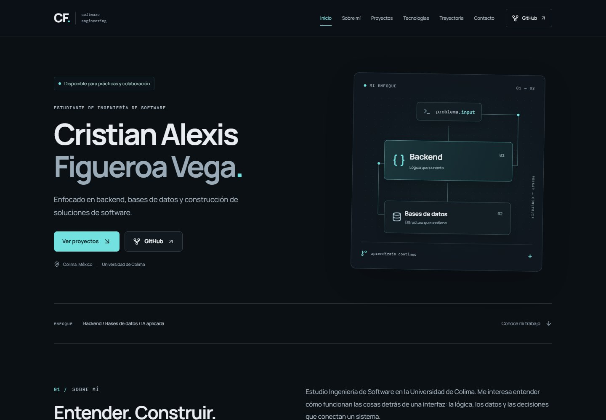

# Cristian Figueroa — Portfolio

Portfolio profesional de **Cristian Alexis Figueroa Vega**, estudiante de Ingeniería de Software de la Universidad de Colima. Presenta proyectos académicos y personales, conocimientos de backend y bases de datos, formación y vías de contacto.

**URL de GitHub Pages configurada:** [crisuxz.github.io/MyPortfolio-CAFV/](https://crisuxz.github.io/MyPortfolio-CAFV/)

> Este repositorio se publica como **project site**. La ruta base es `/MyPortfolio-CAFV/`; el estado de publicación se documenta en [validación](docs/validation.md).



[Página completa en escritorio](docs/previews/desktop.jpg) · [Vista móvil](docs/previews/mobile.jpg)

## Características

- Diseño oscuro carbón con acento cyan, tipografía autoalojada y composición visual de sistemas.
- Hero, sobre mí, cuatro proyectos seleccionados, tecnologías agrupadas, trayectoria y contacto.
- Casos de estudio expandibles con objetivos, evidencia técnica, estado y enlaces reales.
- Tesis claramente marcada **En desarrollo**, en diseño y documentación; diagrama conceptual identificado.
- Navegación sticky con sección activa y menú móvil accesible por teclado.
- Animaciones discretas, `prefers-reduced-motion`, foco visible y salto al contenido.
- Correo mediante `mailto:` y portapapeles con confirmación y recuperación ante permisos denegados.
- Contenido centralizado. Sin API de GitHub en runtime, backend, formularios ficticios ni rutas susceptibles a 404.
- SEO, Open Graph, tarjeta social PNG, favicon, sitemap y pruebas sobre el build real.

## Proyectos seleccionados

| Proyecto | Por qué se incluye |
| --- | --- |
| [Into the Dark](https://github.com/Crisuxz/Into-the-Dark) | Sistemas de juego en Godot/GDScript, documentación técnica y builds. Proyecto colaborativo de DevCrew; no se atribuyen contribuciones individuales no verificadas. |
| [AERG](https://github.com/Crisuxz/Prototipo-AERG) | Tesis que conecta Python, bases de datos e IA aplicada a evaluación académica. Se distingue el objetivo académico de la existencia de un prototipo exploratorio. |
| [PizzaExpress](https://github.com/Crisuxz/PizzaExpress) | Aplicación académica con JavaScript, Express y MySQL; evidencia de rutas, controladores, consultas parametrizadas y bcrypt. |
| [Conversor de YouTube a MP3](https://github.com/Crisuxz/Conversor-de-Videos-YT-a-mp3) | Python aplicado a escritorio: interfaz, metadatos, procesamiento en hilos y extracción de audio. |

La revisión de los **11 repositorios públicos**, las fuentes de cada afirmación y los límites de verificación están en [docs/research.md](docs/research.md). No se publican métricas ficticias ni se presentan prácticas aisladas como productos terminados.

## Stack

| Área | Tecnología |
| --- | --- |
| UI | React 19, TypeScript 6 |
| Build | Vite 8 y plugin React |
| Estilos | Tailwind CSS 4 + CSS con tokens de diseño |
| Movimiento | Motion 13, carga reducida con LazyMotion |
| Iconos | Lucide React |
| Tipografía | Manrope variable e IBM Plex Mono, desde Fontsource |
| Calidad | ESLint 10, typescript-eslint, Playwright, axe-core |
| Publicación | GitHub Actions y GitHub Pages |

Las versiones exactas están fijadas por `package-lock.json`. Se utiliza TypeScript 6 por compatibilidad con el rango soportado por typescript-eslint, sin forzar dependencias incompatibles.

## Requisitos

- Node.js **22.12 o superior**; se recomienda Node.js **24 LTS**, utilizado en CI.
- npm y Git.
- Chromium de Playwright para ejecutar las pruebas de navegador.

## Desarrollo local

```bash
git clone https://github.com/Crisuxz/MyPortfolio-CAFV.git
cd MyPortfolio-CAFV
npm install
npm run dev
```

Abre `http://127.0.0.1:5173/MyPortfolio-CAFV/`.

### Comandos

```bash
npm run dev           # Servidor de desarrollo
npm run lint          # ESLint, sin warnings permitidos
npm run typecheck     # TypeScript estricto
npm run build         # Typecheck + build estático en dist/
npm run preview       # Servir dist/ localmente
```

La vista previa utiliza `http://127.0.0.1:4173/MyPortfolio-CAFV/`. En una instalación limpia o CI utiliza `npm ci` para respetar el lockfile.

### Pruebas de navegador

```bash
npx playwright install chromium
npm run build
npm run test:e2e
```

Playwright inicia automáticamente la vista previa si el puerto 4173 está libre. Las pruebas cubren siete anchos, errores de JavaScript, imágenes, menú, teclado, navegación activa, casos de estudio, enlaces internos, portapapeles, fase de tesis, metadatos, base path y accesibilidad con axe. El CV se valida cuando está configurado. Los reportes y trazas locales no se versionan.

### Actualizar capturas

Con `npm run preview` activo en otra terminal:

```bash
npm run capture:preview
```

Guarda capturas reales desktop/mobile en `docs/previews/`. No se cargan estas capturas en la aplicación pública.

## Arquitectura

```text
.github/workflows/deploy.yml   Validación y publicación
docs/                         Investigación, validación y previews
public/
  assets/                     Recursos estáticos de proyectos y atribución
  cv/README.md                Instrucciones para el PDF original
  favicon.svg
  og-image.png
  robots.txt
  sitemap.xml
scripts/capture-preview.mjs   Capturas reproducibles
src/
  components/                 Navegación, footer, cards, diagramas y Reveal
  data/portfolio.ts           Datos personales, textos, proyectos y skills
  hooks/useActiveSection.ts   Detección de sección activa
  sections/                  Hero, About, Projects, Skills, Journey, Contact
  styles/index.css           Tokens, layout, responsive y movimiento reducido
  types/portfolio.ts          Modelo de proyecto
  App.tsx                    Composición de secciones
  main.tsx                   Entrada y proveedores de Motion
tests/portfolio.spec.ts       Validación del build en Chromium
```

La aplicación es una SPA de una sola URL. Las secciones usan anclas nativas (`#proyectos`), sin React Router. Los componentes presentan los datos de `src/data/portfolio.ts` y no solicitan contenido a servicios externos.

## Personalización

### Información, textos y trayectoria

Edita `profile`, `sectionCopy`, `education`, `certifications` y `navigation` en **`src/data/portfolio.ts`**. El contenido principal está separado de la presentación para facilitar futuras traducciones. La interfaz inicial es únicamente en español.

Cuando cambies nombre, descripción o URL, actualiza también los metadatos estáticos de `index.html`, `public/sitemap.xml`, `public/robots.txt` y la tarjeta social. Estos archivos deben funcionar antes de cargar React.

### Agregar un proyecto

Agrega una entrada a `projects`, respetando `Project` en `src/types/portfolio.ts`: identificador único, nombre, categoría, estado, descripción, objetivo, tecnologías, repositorio, aspectos técnicos y resultado actual. `collaboration` permite documentar autoría compartida y `technologyLabel` distinguir tecnologías previstas.

`visual` selecciona una composición disponible en `ProjectVisual.tsx`. Para una nueva imagen, guárdala optimizada en `public/assets/`, documenta su origen, añade dimensiones, texto alternativo y lazy loading. No uses una representación conceptual como si fuera una captura real.

No se muestran demos porque no se verificó una demo desplegada de los proyectos seleccionados. Solo agrega ese enlace cuando exista y se haya comprobado su funcionamiento.

### Skills

Edita `skillGroups` en el mismo archivo. Mantén categorías concretas y tecnologías respaldadas por el CV o el código. Las tecnologías de un proyecto no implican un nivel de dominio ni autoría exclusiva.

### Incorporar o sustituir el CV

1. Coloca el **PDF original** en `public/CV_Cristian_Alexis_Figueroa_Vega.pdf`.
2. Cambia `profile.cvFile` de `null` a `'CV_Cristian_Alexis_Figueroa_Vega.pdf'`.
3. Ejecuta build y pruebas; comprueba la descarga en la vista previa.

El enlace usa `import.meta.env.BASE_URL`, por lo que funciona en desarrollo y GitHub Pages. No incluyas `public/` en el valor. Actualmente no se muestra el botón: el texto extraído del CV está disponible, pero el PDF original no está en el repositorio.

### Diseño

Los colores y fuentes están definidos al principio de `src/styles/index.css`. Los layouts cambian a 480, 768 y 1024 px; se validan desde 320 hasta 1920 px. La tipografía principal se escala con `clamp()`. No hay cambio de tema: el tema oscuro está diseñado y validado de forma coherente.

## GitHub Pages

Este es un **project site**, no el repositorio `Crisuxz.github.io`:

```ts
// vite.config.ts
base: '/MyPortfolio-CAFV/'
```

Destino configurado: **https://crisuxz.github.io/MyPortfolio-CAFV/**.

### Configuración inicial del repositorio

En **Settings → Pages → Build and deployment → Source**, selecciona **GitHub Actions**. Requiere permisos de administración y que GitHub Pages esté disponible para la visibilidad y el plan del repositorio. No se configura un dominio personalizado ni se necesita `CNAME`.

El workflow `.github/workflows/deploy.yml`:

1. Obtiene el código y configura Node.js 24.
2. Instala con `npm ci`.
3. Ejecuta lint, comprobación de tipos y build.
4. Instala Chromium y ejecuta las pruebas de navegador/accesibilidad.
5. En `main`, configura Pages, sube `dist/` y despliega con las acciones oficiales.

Los pushes a `feat/portfolio-v1` y los pull requests hacia `main` solo validan. La publicación ocurre desde `main` o mediante ejecución manual del workflow en `main`. Los permisos `pages: write` e `id-token: write` se limitan al job de despliegue. No requiere tokens personales en el código.

Los enlaces a secciones son fragmentos de la URL y sobreviven a una recarga. El archivo `robots.txt` se sirve dentro del proyecto; los crawlers consultan normalmente el robots del dominio raíz, que pertenece a otro repositorio. El sitemap de este proyecto queda disponible para registrarlo en Search Console sin modificar el user site.

### About sugerido

Descripción: `Personal software engineering portfolio showcasing projects, backend development and academic work.`

Topics: `portfolio`, `react`, `typescript`, `vite`, `software-engineering`, `developer-portfolio`.

## Rendimiento, accesibilidad y seguridad

- Fuentes locales WOFF2, imagen de proyecto WebP y SVG/CSS en lugar de video o canvas animado.
- Sin analytics, cookies, formularios, peticiones de API en runtime ni secretos en frontend.
- `node_modules/`, `dist/`, `.env*`, archivos temporales y reportes excluidos de Git.
- HTML semántico, un `h1`, secciones con nombres accesibles, `focus-visible`, skip link y `details` nativo.
- Menú móvil con estado expandido, cierre por Escape, clic externo, cambio de breakpoint y salida del foco.
- Animaciones de aparición sin ocultar contenido; sin movimiento continuo y desactivadas con preferencia de movimiento reducido.

Resultados, alcance y limitaciones de la validación: **[docs/validation.md](docs/validation.md)**.

## Recursos y contacto

El recurso gráfico de Into the Dark conserva la autoría y derechos del proyecto original; véase [atribución](public/assets/README.md). Las fuentes y los iconos se distribuyen bajo sus respectivas licencias, incluidas en los paquetes. No se atribuye a Cristian el trabajo individual de sus compañeros.

- GitHub: [Crisuxz](https://github.com/Crisuxz)
- Correo: [dev.crisfive.mx@gmail.com](mailto:dev.crisfive.mx@gmail.com)
- Ubicación: Colima, México
